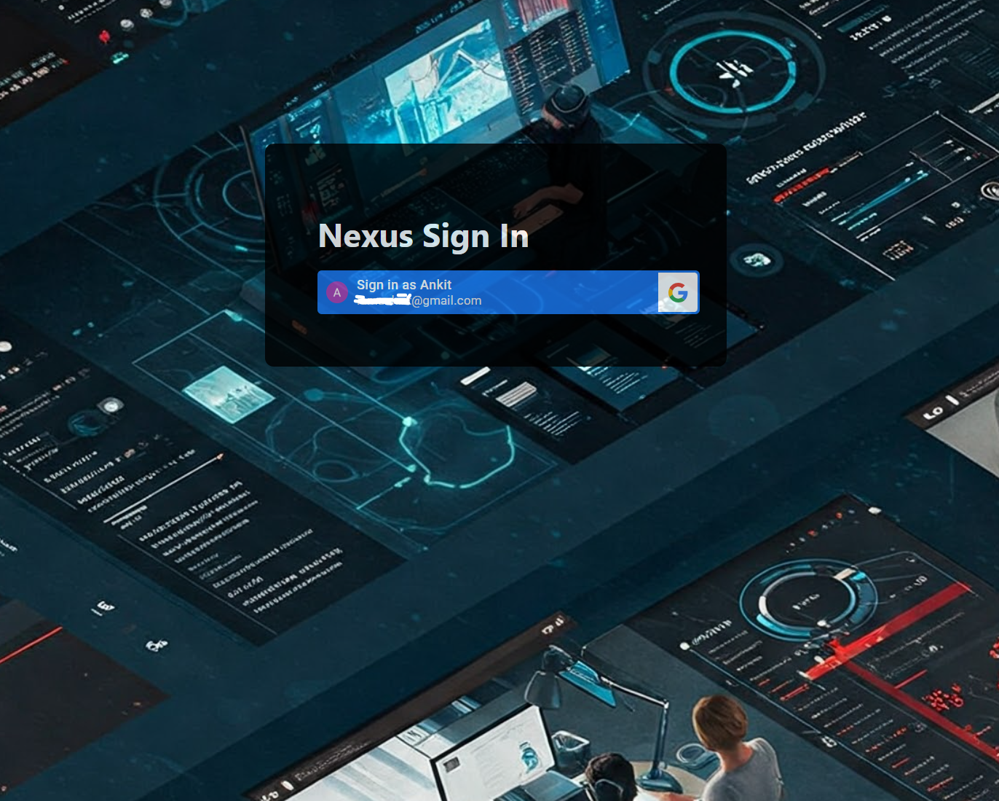

<div align="center">

# NexusApp

### A modern employee portal built for seamless workplace experience

[](https://angular.dev)
[](https://tailwindcss.com)
[](https://www.typescriptlang.org)
[](.)

</div>

---

## Overview

**NexusApp** is a unified employee intranet portal that consolidates day-to-day workplace tools into a single, modern interface. Built with Angular 19 and Tailwind CSS, it delivers a fast, responsive experience for associates to stay connected with their organisation.

<div align="center">



</div>

---

## Features

| Feature | Description |
|---|---|
| **Secure Login** | Authenticated access with sign-in / sign-out flow |
| **Personalised Dashboard** | Welcome banner, user profile, and quick-access widgets |
| **Latest Tech News** | Swiper-powered news carousel with the latest updates |
| **Trending Apps** | Browse and launch internal tools from an app carousel |
| **App Store** | Discover and access the full catalogue of internal apps |
| **Associate Details** | View your profile, role, and contact information at a glance |
| **Holiday & Leave** | Track upcoming holidays and your leave balance |
| **Compliance Status** | Stay on top of mandatory compliance tasks |
| **Timesheet** | Log and manage your working hours |
| **My Learning** | Access your learning and development resources |

---

## Tech Stack

- **Framework:** [Angular 19](https://angular.dev) with standalone components and lazy-loaded routes
- **Styling:** [Tailwind CSS v4](https://tailwindcss.com) via PostCSS
- **Carousel:** [Swiper 11](https://swiperjs.com)
- **Language:** TypeScript 5.7
- **Testing:** Karma + Jasmine

---

## Getting Started

### Prerequisites

- [Node.js](https://nodejs.org) v18 or later
- [Angular CLI](https://angular.dev/tools/cli) v19

```bash
npm install -g @angular/cli
```

### Installation

```bash
# Clone the repository
git clone https://github.com/ankiiitGit/nexusui.git
cd nexusui

# Install dependencies
npm install
```

### Running Locally

```bash
npm start
```

Navigate to `http://localhost:4200/`. The app hot-reloads on file changes.

### Build for Production

```bash
npm run build
```

Compiled output is placed in the `dist/` directory, optimised for performance.

### Running Tests

```bash
npm test
```

---

## Project Structure

```
src/
├── app/
│   ├── core/
│   │   └── components/
│   │       ├── header/        # Sticky navigation bar
│   │       ├── footer/        # Footer
│   │       ├── banner/        # Hero banner
│   │       └── app-store/     # Internal app catalogue
│   ├── pages/
│   │   ├── login/             # Authentication page
│   │   └── home/              # Main dashboard
│   └── shared/
│       ├── components/        # Reusable widgets
│       │   ├── apps-carousal/
│       │   ├── news-carousal/
│       │   ├── associate-details/
│       │   ├── holiday-leave-card/
│       │   ├── compliance-status/
│       │   ├── timesheet/
│       │   └── learning/
│       ├── models/            # TypeScript interfaces
│       ├── pipes/             # Custom Angular pipes
│       └── services/          # Auth and data services
└── styles.css
```

---

## Contributing

1. Fork the repository
2. Create a feature branch: `git checkout -b feature/your-feature`
3. Commit your changes: `git commit -m 'Add your feature'`
4. Push to the branch: `git push origin feature/your-feature`
5. Open a Pull Request

---

<div align="center">

Made with ❤️ using Angular & Tailwind CSS

</div>
